Frontend Developer & UX/UI Designer who **designs directly in code** — building with **React**, **Next.js**, and **TailwindCSS**, and shipping full-stack systems with **Spring Boot** and **MySQL**.

&nbsp;
&nbsp;

 

## About Me

I work at the intersection of **design and engineering** — I take a product from first idea to a deployed, responsive app, and I design it right where it will live: in the browser.

- **Design in code** — I shape layouts, motion, and interactions directly in React, so what I design is exactly what ships. Nothing gets lost in translation.
- **End-to-end capability** — I've shipped full-stack applications with secure authentication, REST APIs, and relational databases (see **AttendMe** below).
- **Accessibility & craft** — digital products should be beautiful, accessible, and human. Clean code and thoughtful UX aren't competing goals; they're the same goal.
- **Always leveling up** — deepening my backend skills with **Spring Boot** and adopting **TypeScript** for safer, more maintainable codebases.

 

## Featured Projects

<table>
  <tr>
    <td width="50%" valign="top">
      
      <h3>Aura Beauty</h3>
      
Scroll-synced WebGL storytelling for a premium cosmetics brand — a 3D product that rotates and morphs as you scroll, at 60 FPS.

      
<code>Next.js</code> <code>TypeScript</code> <code>React Three Fiber</code> <code>GSAP</code>

      
      
    </td>
    <td width="50%" valign="top">
      
      <h3>AttendMe</h3>
      
Role-based attendance management for schools — JWT auth, a Spring Boot REST API, a React web app, and an Android client.

      
<code>React</code> <code>Spring Boot</code> <code>MySQL</code> <code>Android</code>

      
      
    </td>
  </tr>
  <tr>
    <td width="50%" valign="top">
      
      <h3>Cozy Pomodoro</h3>
      
A calm, lofi-inspired Pomodoro timer with a pixel cat companion and ambient audio synthesized with the Web Audio API.

      
<code>React</code> <code>Tailwind CSS</code> <code>Web Audio API</code>

      
      
    </td>
    <td width="50%" valign="top">
      
      <h3>Nook</h3>
      
A cozy 3D room arranger — drag, snap, and recolor furniture, re-skin the room in one click, and meet the pathfinding cat.

      
<code>React</code> <code>TypeScript</code> <code>React Three Fiber</code> <code>Zustand</code>

      
      
    </td>
  </tr>
</table>

 

## What I Bring to a Team

| Strength | In Practice |
|---|---|
| **UX/UI Design** | User flows, layout, and interaction design — shaped directly in code and refined in the browser |
| **Frontend Engineering** | Responsive, component-driven interfaces with React, Next.js + TailwindCSS |
| **3D & Motion** | Scroll-driven WebGL scenes with React Three Fiber and GSAP |
| **Full-Stack Development** | REST APIs and secure auth with Spring Boot + MySQL; Django + Python experience |
| **Design-to-Code Fluency** | I close the designer–developer gap because I'm both |
| **Shipping** | Every featured project above is deployed and live — not just a repo |

 

## Tech Stack

### Frontend

### 3D & Motion

### Backend & Databases

### Tools & Platforms

### Currently Learning

 

## GitHub Activity

<picture>
  <source media="(prefers-color-scheme: dark)" srcset="./assets/contribution-bloom-dark.svg" />
  
</picture>

  

  

 

 

## Let's Build Something

I'm open to **frontend, UX/UI, and full-stack opportunities**, including internships, entry-level roles, freelance projects, and collaborations. If you need someone who can own a feature from first idea to production deploy, I'd be glad to talk.

&nbsp;

> *"If everything goes wrong, you have to fight to the bitter end and push yourself to your limits."*

